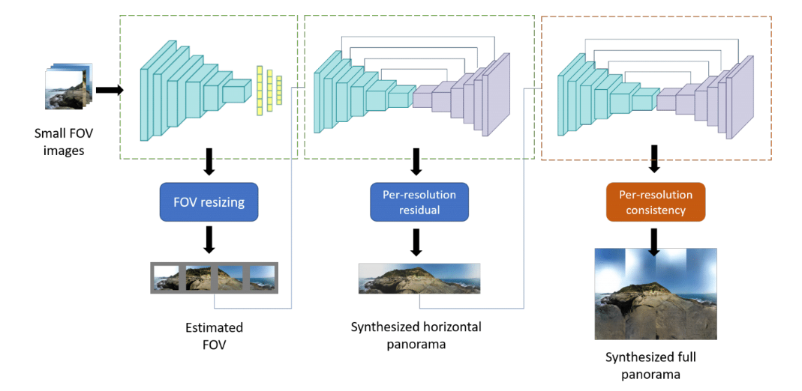
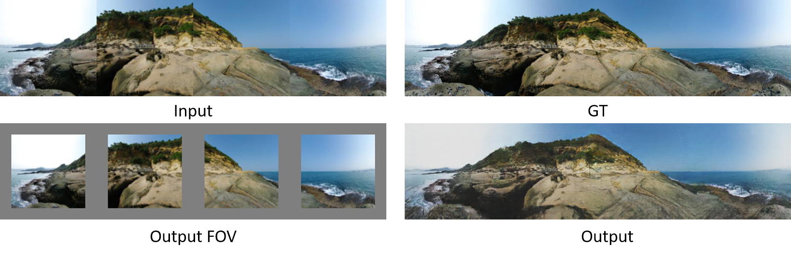
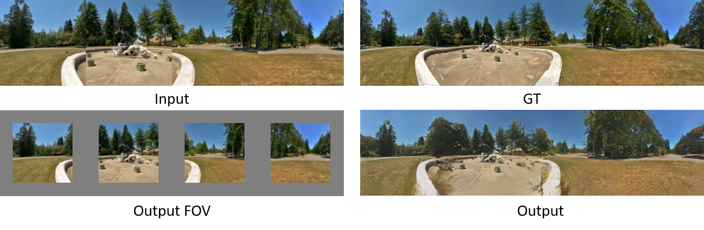
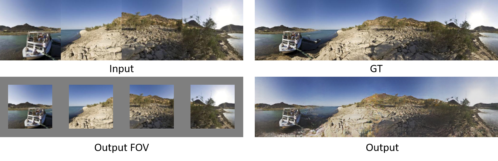

# pano_synthesis
Partial panorama synthesis based on hierarchical model

### Introduction
FOV panorama prediction and partial panorama synthesis (128 x 512) implemented in Tensorflow. \
Implemented with hierarchical GAN based network.

### Results
Input is 4 panorama images concatenated together. The FOV is predicted and the input processed into panorama with missing pixel based on the FOV. 
###### Output 1.

###### Output 2.

###### Output 3.

### Prerequisites
* Python 2.7
* OpenCV
* Tensorflow
